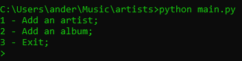
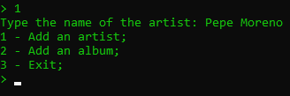
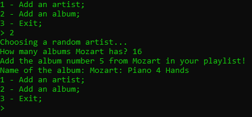
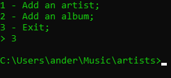
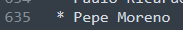
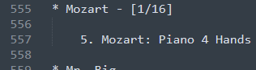
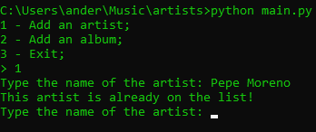
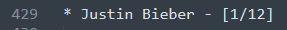

#### RANDSONGPICK - Pick random music

This is a program written in Python made to help you choose an album from an artist when you don't know which to choose.

The idea is to maintain a list of artists, each one of them has the number of albums (or Singles / EPs, it's your choice actually), and every time you want to listen a random album, the program will return a number that indicates the number of the album chosen randomly.

#### USAGE

I made this program with Python 3.9, so it's recommended to use this version.

First, be sure that you have a file called `artists.txt` along with the other files (an example file is in the repository).

After that, just run the program with `python3 main.py` on your command prompt (Windows), or in a terminal (Linux, MACOS).

#### QUICK TUTORIAL

This is what you see when you execute the script.

Now you have added an artist after have selected `1` and typed the name of an artist that isn't listed yet. In this case, we added Pepe Moreno (Oh Juliana!)

Here is the magic: When you select `2`, the program will generate a random number between 1 and the list size. So, with this number, if the artist chosen randomly wasn't listened before, the program will ask how many albums he has. It's up to you to search on the web or count this number on a stream platform of your choice (mine was [Spotify](https://www.spotify.com/)).

With these numbers, the program will generate a random number between 1 and the number of albums (or Singles / EPs) and tell you which album number. The 'album number' actually is just a way to say, if it's 10 for example: You can pick the 10th album from the first this artist released, or the 10th from the last album... It's up to you how to use this information.

Finally, after you've added this album on your playlist (if you want to), type the name of the album, so you can control which album you already listened.

When exiting the program, all the data that you've changed while adding artists and albums will be saved on the `artists.txt` file.

You've added Pepe Moreno on the list.

You've added a Mozart's album (listed on Spotify).

In case you type an existing artist, a message will be prompted.

The info between `[1/12]` says: You've listened 1 of 12 albums from Justin Bieber... When you reach 12 albums listened, Justin will be erased from the list.

#### FURTHER IMPROVEMENTS

I've got to confess: I made this program very fast, just because I was spending too much time generating random numbers on google, searching for artists that were already on my list and typing every single album, and changing the counters... So, if you have a suggestion (of course you have), let me know! You can open issues or even do a pull request.

##### This project is in development phase for mobile (Kivy, maybe)

